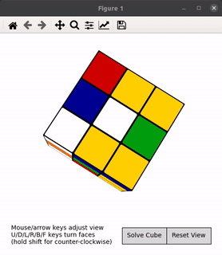

# 3x3RubikCubeAR-Solver
I've seen this made everywhere and I wanted to try it myself from zero. #NoDeepLearningChallenge

## Color Detection

## 3D Conversion

### Special Thanks To...
[damo-da](https://github.com/damo-da/rubiks-cube) and its amazing 3D representation of the Rubik's Cube which I minimally modified to accomodate my code.
There is a **huge** problem with somehow the rotation and some localization of the sickers when converted to 3D that I really don't want to solve because that requieres **effort** and I'm not into that rn.
